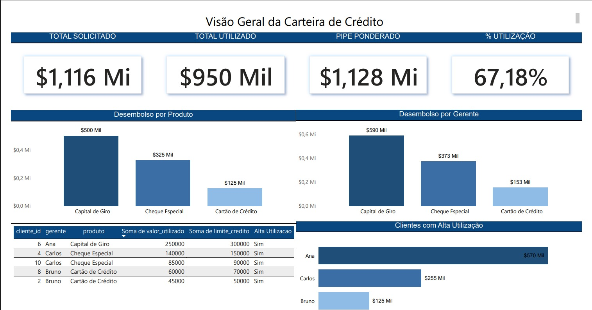

# 📊 Análise de Carteira de Crédito

Projeto de Business Intelligence desenvolvido para análise de desempenho e risco em carteira de crédito.

## 🎯 Objetivo

Analisar a carteira com foco em:

- Volume solicitado e utilizado
- Pipeline ponderado
- Distribuição por produto e gerente
- Identificação de clientes com alta utilização

## 🛠️ Tecnologias

- SQL
- Power BI
- Excel / CSV
 

 Insights
- Concentração de crédito por produto
- Performance por gerente
- Potencial de desembolso futuro
- Identificação de clientes com alta utilização
 
 Diferenciais
- Construção de pipeline ponderado
- Análise integrada de performance e risco
- Estrutura completa: dados → análise → visualização

